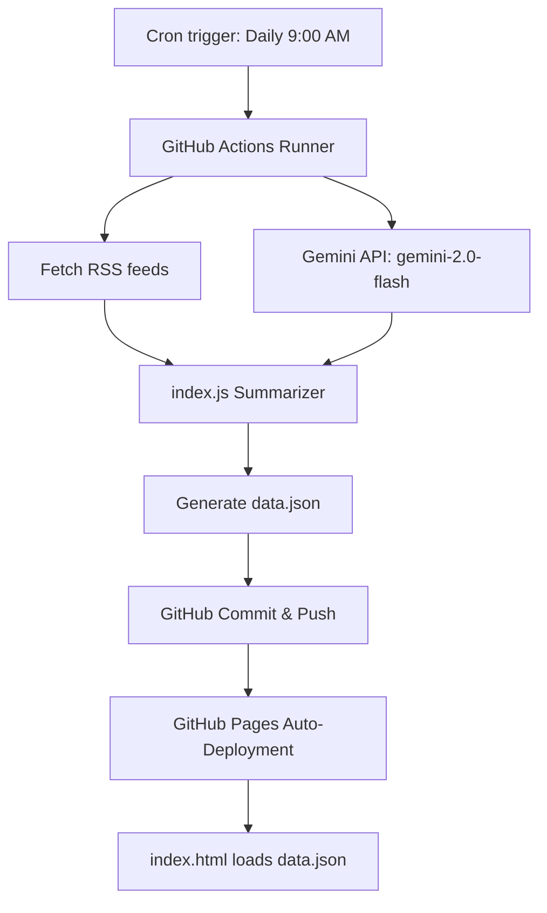

# YCombinator-Style AI News Hub (GitHub Pages + Actions)

We will revise the architecture to separate content generation (Node.js script running on GitHub Actions) from presentation (modern interactive HTML/CSS static web app hosted on GitHub Pages). The script will run daily at 9:00 AM (e.g. UTC/EDT) to fetch RSS feeds, summarize them using `gemini-2.0-flash` (cheapest & fastest), and commit a structured `data.json` file. The frontend will dynamically fetch and display this data.

## Architecture Diagram



## Folder Structure (under new `AI-news` directory)

```
AI-news/
├── .github/
│   └── workflows/
│       └── daily-update.yml  # GitHub Actions schedule & run script
├── public/                    # Frontend presentation assets
│   ├── index.html            # Premium YC-style Single Page Web App
│   ├── styles.css            # Custom premium dark-theme CSS
│   └── app.js                # Frontend data rendering and interaction
├── data.json                 # Generated daily updates (Agents, Models, Tools, Companies, Learning)
├── index.js                  # Runs fetcher and summarizes into data.json
├── fetcher.js                # Fetches feed items
├── summarizer.js             # Calls Gemini API (using gemini-2.0-flash)
├── config.js                 # Global configuration & feed sources
├── package.json              # Dependencies
├── .gitignore                # Protects .env, node_modules
└── README.md                 # Complete project setup guide
```

## YC & Startup Design Vision

- **Vibe**: Sleek, futuristic, high-information-density but clean dashboard (linear gradients, glassmorphism, glowing micro-borders, elegant typography like `Outfit` or `Inter`).
- **Interactive Cards**:
  - **🤖 Agents** (Top 3 news cards with click-to-expand summaries)
  - **🧠 Models** (Top 3 cards)
  - **🛠️ Tools** (Top 3 cards)
  - **🏢 Companies** (Top 3 cards)
  - **🎓 Learning & Upskilling** (New courses, labs, tutorials, or guides)
- **Top Bar**: Last updated timestamp, quick filters, links to source articles.

## Security & Costs

- **API Security**: The `GEMINI_API_KEY` is stored securely as a **GitHub Repository Secret**. The script reads it from environment variables at runtime, ensuring it is never exposed in the source code or build logs.
- **Model Efficiency**: Uses `gemini-2.0-flash` for super fast summaries at extremely low token costs.
- **Git Protection**: `.gitignore` will contain `.env` and `node_modules`.

## Proposed Changes

### [Component: Content Builder]
- **`index.js`**: Refactored to write structured JSON outputs to `data.json` rather than markdown files.
- **`summarizer.js`**: Updates prompt to return structured JSON conforming to categories (including *Learning Paths* and limiting entries to top 3).

### [Component: Web Dashboard]
- **`public/index.html`**: Clean, semantic HTML5 structure with modern SEO tags.
- **`public/styles.css`**: CSS defining dark mode colors, glassmorphism, responsive grid layout, and card hover effects.
- **`public/app.js`**: Fetches `./data.json` and populates the cards with smooth entrance animations.

### [Component: CI/CD Automations]
- **`.github/workflows/daily-update.yml`**: Uses `cron` expression to run daily at 9:00 AM, configures Node, installs dependencies, fetches data, runs the builder, and commits the updated `data.json`.
